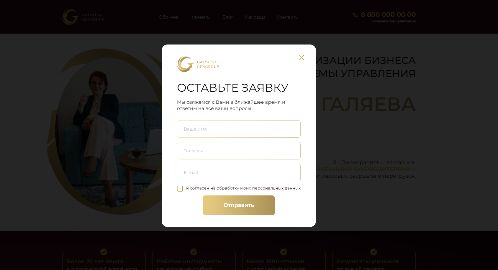
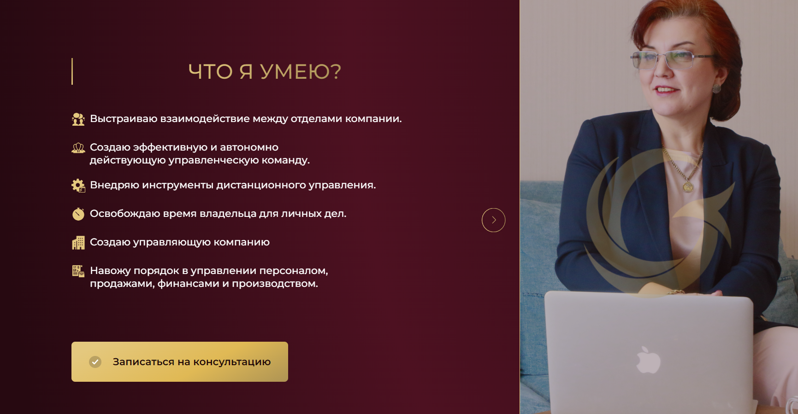
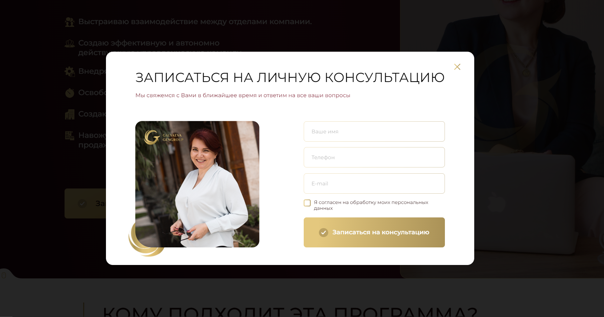
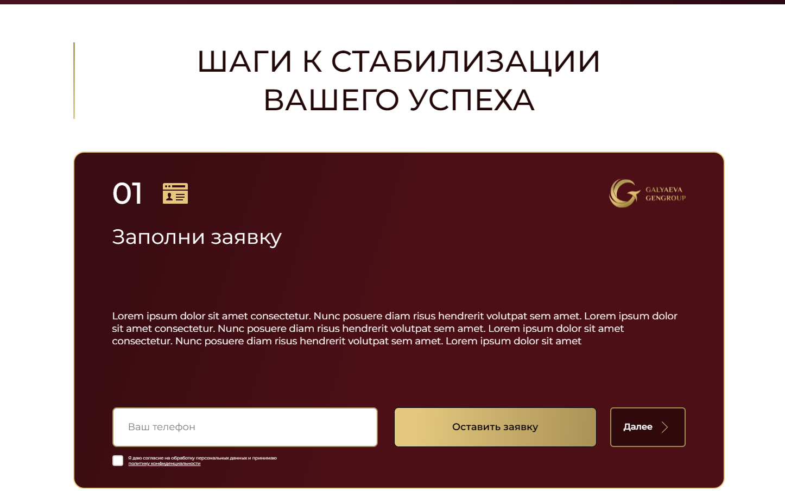

# Galyaeva Gengroup - MODX Case

Данный проект был разработан в рамках кейс-задания от заказчика. Я выполнил верстку HTML-страницы на основе дизайна, предоставленного в Figma, и затем перенес ее на CMS MODX.

## О проекте

Galyaeva Gengroup - это проект, созданный Евгенией Галяевой, которая помогает управленцам стать профессиональными руководителями и избавиться от текучки, кассовых разрывов и перегрузок.

## Возможности

- Проведение глубокой аналитики бизнес-процессов
- Разработка жизнеспособной стратегии развития компании
- Стабилизация финансового состояния бизнеса
- Увеличение прибыли на текущих оборотах
- Избавление от текучки персонала
- Разработка оптимальной оргструктуры компании
- Внедрение инструментов дистанционного управления
- Освобождение времени владельца для личных дел
- Создание управляющей компании

## Для кого

Программа Galyaeva Gengroup подходит для компаний со следующими характеристиками:

- Оборот от 1 млрд рублей
- Сложная структура (группа компаний)
- Непредбанкротное состояние
- Готовность собственников вкладывать время в наведение порядка

## Результаты

До работы с Galyaeva Gengroup компании сталкиваются с такими проблемами, как нехватка персонала, неуверенность в будущем, низкая прибыль, кассовые разрывы. После работы с Galyaeva Gengroup компании получают:

- Переизбыток персонала
- Точный стратегический план на несколько лет
- Согласие между топ-менеджерами и владельцами
- Эффективную команду топ-менеджеров и свободное время
- Максимальный уровень прибыли в сегменте
- Пополняемые резервные фонды, руководители в полной координации

## Скриншоты

## Контакты

Связаться с Евгенией Галяевой можно через [Telegram](https://t.me/s/galiaeva_ev).